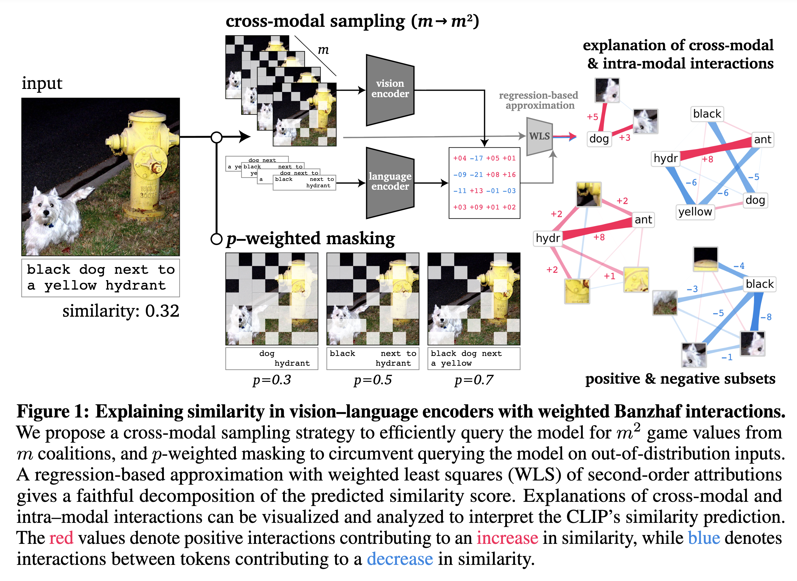
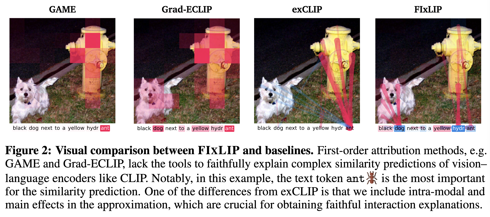

<div align="center">
  
# FIxLIP [NeurIPS 2025] 

[](https://arxiv.org/abs/2508.05430)
[](https://neurips.cc/Conferences/2025)
</div>

This repository is a code supplement to the following [paper](https://openreview.net/forum?id=on22Rx5A4F):

> H. Baniecki, M. Muschalik, F. Fumagalli, B. Hammer, E. Hüllermeier, P. Biecek. **Explaining Similarity in Vision-Language Encoders with Weighted Banzhaf Interactions**. *NeurIPS 2025*

**TL;DR:** We introduce faithful interaction explanations of CLIP and SigLIP models (FIxLIP), offering a unique, game-theoretic perspective on interpreting image–text similarity predictions.

[](https://openreview.net/forum?id=on22Rx5A4F)

## Setup

```bash
conda env create -f env.yml
conda activate fixlip
```

## Getting started

Check out the demo for explaining CLIP with FIxLIP in `example.ipynb`.

```python
import src
import torch
from PIL import Image
from transformers import CLIPProcessor, CLIPModel
# load model
processor = CLIPProcessor.from_pretrained("openai/clip-vit-base-patch32")
model = CLIPModel.from_pretrained("openai/clip-vit-base-patch32")
model.to('cuda')
# load data
input_text = "black dog next to a yellow hydrant"
input_image = Image.open("assets/dog_and_hydrant.png")
# define game
game = src.game_huggingface.VisionLanguageGame(
    model=model,
    processor=processor,
    input_image=input_image,
    input_text=input_text,
    batch_size=64
)
# define approximator
fixlip = src.fixlip.FIxLIP(
    n_players_image=game.n_players_image,
    n_players_text= game.n_players_text, 
    max_order=2,
    p=0.5, # weight
    mode="banzhaf",
    random_state=0
)
# compute explanation
interaction_values = fixlip.approximate_crossmodal(game, budget=2**19)
print(interaction_values)
# visualize explanation
text_tokens, input_image_denormalized = ...
src.plot.plot_image_and_text_together(
    iv=interaction_values,
    text=text_tokens,
    img=input_image_denormalized,
    image_players=list(range(game.n_players_image)),
    plot_interactions=True,
    ...
)
```

[](https://openreview.net/forum?id=on22Rx5A4F)


## Running experiments

* `src` - main code base with the FIxLIP implementation
* `data` - code for processing datasets
* `experiments` - code for running experiments
* `results` - experimental results
* `analysis` - analyze and visualize the results
* `gradeclip` - code and experiments with Grad-ECLIP
* `exclip` - code and experiments with exCLIP

## Citation

If you use the code in your research, please cite:

```bibtex
@inproceedings{baniecki2025explaining,
    title     = {Explaining Similarity in Vision-Language Encoders 
                 with Weighted Banzhaf Interactions},
    author    = {Hubert Baniecki and Maximilian Muschalik and Fabian Fumagalli and 
                 Barbara Hammer and Eyke H{\"u}llermeier and Przemyslaw Biecek},
    booktitle = {Advances in Neural Information Processing Systems},
    year      = {2025},
    url       = {https://openreview.net/forum?id=on22Rx5A4F}
}
```

## Acknowledgements

FIxLIP is powered by [`shapiq`](https://github.com/mmschlk/shapiq). See also [Grad-ECLIP](https://openreview.net/forum?id=WT4X3QYopC) and [exCLIP](https://openreview.net/forum?id=HUUL19U7HP).


This work was financially supported by the state budget within the Polish Ministry of Science and Higher Education program "Pearls of Science" project number PN/01/0087/2022.